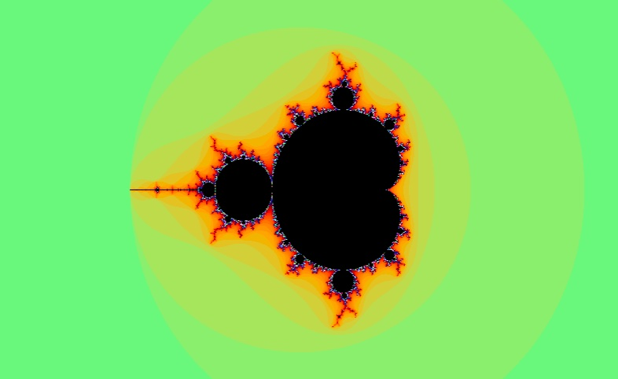

# Almondala



- [This repo](#this-repo)
- [Description](#description)
- [Name](#name)
- [Usage](#usage)
- [Credits](#credits)
- [Setup](#setup)
- [Experimental branches](#experimental-branches)
- [Benchmarking](#benchmarking)
- [Further](#further)

## This repo

This repo is a testbed for working on a mobile-friendly version of my [Almondala](https://almondala.netlify.app/) project. In this one, I renamed the `public` folder `docs` to allow me to deploy from it to GitHub Pages, since that platform doesn't have the option to deploy from public.

## Description

[Almondala](https://almondala.netlify.app/) is a [Mandelbrot set](https://en.wikipedia.org/wiki/Mandelbrot_set) explorer, written in Rust (compiled to WebAssembly) and TypeScript.

## Name

[Benoit Mandelbrot](https://en.wikipedia.org/wiki/Benoit_Mandelbrot) discovered this fractal. His surname is is German for "almond bread". I coined Almondala as a [portmanteau](https://en.wikipedia.org/wiki/Blend_word) of almond and [mandala](https://en.wikipedia.org/wiki/Mandala).

## Usage

- Keys:
  - Arrow keys to pan.
  - `X` to zoom in.
  - `Z` to zoom out.
  - SPACE or ESCAPE to reset.
- Mouse:
  - Click on a point of the Mandelbrot to move it to the center of the canvas.
  - Double click to move and zoom.
  - Drag a point to move it to a new location on the canvas.
- Buttons.
  - RAINBOW to toggle color/grayscale.
  - `⟲` to replay zoom, i.e. to zoom out to the initial scale or to zoom back in to the scale at which the replay started.
  - `+` and `-` to the adjust maximum number of iterations to check before coloring a pixel black. Higher values give greater precision, but take longer.
  - `i` for a reminder of this info.
  - `˄` and `˅` to increment/decrement the power to which `z` is raised in the equation. The default exponent is `2`, giving rise to the Mandenbrot set itself. More generally, for a power `d`, the fractals produced by the equation `z -> z^d + c`, are called [multibrot sets](https://en.wikipedia.org/wiki/Multibrot_set).

Resizing the window also resets the view.

## Credits

Two features are closely based on the example in section 15.14 of David Flanagan in `JavaScript: The Definitive Guide`, 7th edition, 2020, namely the worker pool and the idea of partitioning the canvas into tiles.

From Ross Hill's [Mandelbrot.site](https://github.com/rosslh/Mandelbrot.site), I got idea of checking the perimeter of the tile first and coloring the whole tile black if no point on the perimeter escapes.

## Setup

Simply view online at [Almondala](https://almondala.netlify.app/).

Alternatively, here is a guide to build and run locally. First, clone the repo and navigate into it by entering the following commands into a terminal:

```bash
git clone https://github.com/pjtunstall/almondala
cd almondala
```

[Install Rust](https://www.rust-lang.org/tools/install), if you haven't already.

Make sure you have `wasm-pack` installed:

```bash
cargo install wasm-pack
```

Install [Node.js](https://nodejs.org/en) if you don't already have it. This will also install `npm` (Node Package Manager). Then install TypeScript and the related `undici-types` package as dev dependencies with the commmand

```
npm install
```

Install `wasm-opt`:

- Download it from the [Binaryen releases page](https://github.com/WebAssembly/binaryen/releases)
- Or follow the instructions at the [Binaryen GitHub repo](https://github.com/WebAssembly/binaryen#tools)

Run my [build script](./package.json) with

```bash
npm run build
```

NOTE: This script includes a final step that corrects the import path in `worker.js` for the Wasm module from "relative to the TypeScript source file" (as required by the TypeScript compiler) to "relative to the compiled JavaScript file" (so that `worker.js` itself can actually import the Wasm module). This should run different instructions depending on the platform, but, as yet, has only been tested on macOS.

Start a local server, for example:

```bash
python3 -m http.server
```

Open a browser. When the popup prompts you, allow the application to accept incoming connections. Then navigate to `http://localhost:8000/public/`.

## Experimental branches

This repo includes several old feature branches. At present, these are in raw JavaScript, as they date to before I switched to using TypeScript for the project. Another significant change I've made to the main branch since I last touched them is that I'm no longer trying to parallelize the Rust with the [Rayon](https://docs.rs/rayon/latest/rayon/) crate (library). [Benchmarking](#benchmarking) showed that Rayon made the calculations 1.8 times slower. As I now realize, WebAssembly doesn't have direct support for multithreading at the hardware level and instead relies on JavaScript worker threads for parallelism. Hence, I assume, I was getting all of the overhead and none of the benefit of Rayon.

- `fake`: a progressive loading effect: panning or zooming the current frame before calculating the next one. (Works up to a point, but a series of pans and zooms will eventually get out of sync with the properly calculated view, maybe due accumulated rounding errors. In the current asynchronous setup, there would also be the issue of rendered values always falling behind the actual state, hence why I've only used the effect for the replay zoom.)
- `offscreen`: two worker threads, each of which puts its image to an `OffscreenCanvas`. A request to calculate is sent to both simultaneously. One does a quick first pass with a smaller iteration limit. The main thread toggles the opacity of the two canvases to display the results as needed. (Works, but with occasional glitchy jumps, and reset is jarring on Firefox. Essentially supersceded when I successfully introduced the worker pool that's now used in `main`.)
- `lines`: an attempt at calculating odd and even numbered columns separately, one after the other, so as to have something to display faster, while waiting for the rest of the calculation. (The basic idea of calculating alternate lines works--the Rust does its job--but the branch is not yet fully functional. It derived from `offscreen`, and I think the two workers/canvases are complicting matters.)
- `shared`: an attempt at sharing memory between JS and Wasm. (Not yet working. The idea is still relevant as a possible future optimization.)

See their `README`s for more info.

## Benchmarking

In earlier versions, I somehow unnecessarily wound up using `Vec<u8>` for each pixel, even though each one always consists of four bytes. When this came to my attention, I switched to using `[u8; 4]`, and took the opportunity to compare the performance.

Originally, I calculated the color of each pixel every render. Now I use tables of precalculated values. The tables, `COLORS` and `SHADES` are generated by a macro in the `generate_tables` crate. again, I compared the performace.

On a 2013 MacBook Air, I compared 100 million calls, passing a random escape iteration value to the function that generates a colored pixel; likewise the function that generates a grayscale pixel. The `Vec<u8>` versions took 80 and 71 seconds respectively. The `[u8; 4]` versions took 60 and 52 seconds. With the current technique of lookup tables, this is further to 47 seconds.

Here is how I timed my old Mandelbrot calculation when I was using [rayon](https://docs.rs/rayon/latest/rayon/), before I realized that a single instance of the Wasm module doesn't have access to multithreading. The mean duration was 903ms (standard deviation 51ms). Without `rayon`, it was 585ms (standard deviation 66ms).

```javascript
const phi = 1.618033988749895;

async function benchmarkMandelbrot() {
  const start = performance.now();

  calculate_mandelbrot(phi * 600, 600, 1024, 1024, -0.6, 0, phi, 1, 23, 17, 17);

  const end = performance.now();
  const duration = end - start;

  return duration;
}

const durations = [];
for (let i = 0; i < 100; i++) {
  const duration = await benchmarkMandelbrot();
  console.log(`${i}. ${duration}ms`);
  durations.push(duration);
}

const averageDuration =
  durations.reduce((sum, duration) => sum + duration, 0) / durations.length;
console.log(`${averageDuration}ms (average)`);

const std = Math.sqrt(
  durations.reduce(
    (sum, duration) => sum + Math.pow(duration - averageDuration, 2),
    0
  ) / durations.length
);
console.log(std);
```

## Further

Further developments may include:

- CODE
  - Refactor:
    - Split up the `State` class (separate the UI from the mathematical state)? And, more generally, review the code in the light of best practices.
    - Look out for suitable places to use the characteristic TS object types: enum, interface, union, intersection, extension.
  - Test:
    - Test Rust: calculate some known values, fuzz test set inclusion for values in known regions.
    - Test UI: creation & existence of elements, fuzz test with random input events, explore determinstic simulation testing.
    - Try it out on as many combinations of devices, screen sizes, aspect ratios, resolutions, operating systems, and browsers and possible.
  - Optimize:
    - Try out different ways to order and time how the tile data is made visible.
    - Reuse perimeter calculation of tiles, also shared edges.
    - Share memory between Wasm and JS.
    - Try making calculations cancellable so that some could skipped as an alternative to processing multiple slow requests that come close together. Be sure to benchmark to see if it actually helps. In Rust, this could be done with an async runtime like [tokio](https://docs.rs/tokio/latest/tokio/). On the JavaScript end, look into [AbortController](https://developer.mozilla.org/en-US/docs/Web/API/AbortController).
    - Benchmark with and without wasm-opt, and try out different wasm-opt options. I'm currently using this tool to optimize compilation. See the build script in `package.json`. (Option `02` is recommended as generally best for performance, but there are many details that can be customized.)
- FEATURES
  - Allow arbitrary exponents, including negative and fractional.
  - More buttons:
    - Share state by encoding it in the URL.
    - Save image.
  - Touchscreen gestures: pinch and zoom.
  - Explore different color schemes to offer as options.
  - Investigate how to safely represent numbers with [arbitrary precision](https://en.wikipedia.org/wiki/Arbitrary-precision_arithmetic). At the moment, zoom is limited by to the precision of 64-bit floats. In practice, below `2e-13`, the image starts to get blocky. One strategy might by to represent `scale`, `mid.x`, and `mid.y` in TypeScript with the `Decimal` type from `decimal.js-light` and serialize them to pass to Rust. In Rust, I could use the [rug](https://docs.rs/rug/latest/rug/index.html) crate (library). The Rust function `calculate_mandelbrot` would receive them as type `String`. It could then deserialize them them as instances of `rug::Float`, a "multi-precision floating-point number with arbitrarily large precision and correct rounding", setting the precision based on the length of the `String`. An instance of the corresponding arbitrary-precision complex type `rug::Complex` could then be constructed from the real and imaginary parts. As I understand it, since the precision of `rug::FLoat` and `rug::Complex` has to be set during construction, arithmetic operations would have to be wrapped with logic to set an appropriate precision for the outcome.

Finally, a CI/CD-related point. For a while, I had Netlify run the build script on each deployment via a `netlify.toml` file in the root of my project with the following:

```toml
[build]
  command = "curl --proto '=https' --tlsv1.2 -sSf https://sh.rustup.rs | sh -s -- -y && source $HOME/.cargo/env && npm run build"
  publish = "public"

[build.environment]
  RUST_VERSION = "stable"
```

But when I introduced wasm-opt, it seemed more convenient to just build locally. At some point, I may explore installing and caching wasm-opt in the Netlify build environment. Alternatively, I might look into using a custom Docker image to ensure a more controlled and consistent build environment.
